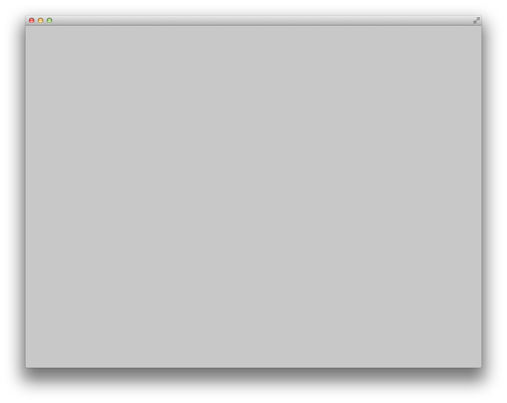

# About emptyExample

### Learning Objectives

This example is the simplest possible openFrameworks app! It does nothing. 

...Well, *almost* nothing. Although it may not be apparent, the emptyExample activates all of the default system states. (For example, it sets the default fill color to white; it just doesn't happen to draw anything with it.)

The emptyExample is great for making sure that your openFrameworks development environment is compiling properly. It can also be useful as a "starter template" for making simple programs. 

The emptyExample will help you understand what are the bare necessities of an openFrameworks program. In this regard, you can think of it as a "Hello World" for OF. 

### Expected Behavior

When launching this app, you should see a light-gray screen. 

* There's no interaction. 
* There's nothing to see. 
* That's it. 

Instructions for using the app:

* There's nothing to do. Move along.

### Other classes used in this file

This example uses no other classes.