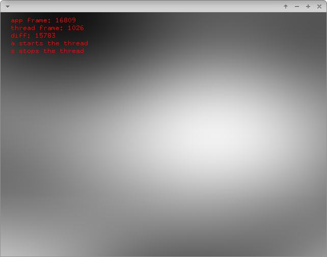

# threadExample



### Learning Objectives

This example demonstrates how to use threads and what impact it has to lock a threaded function. It includes an example function that creates a noisy texture. This function is executed in a parallel thread, that means you can do other stuff in the main```update()``` loop that will not be affected by the computation time of the noise texture. Not locking the function that creates the texture will lead to tearing since the buffer of the pixels is accessible even if the current processing step of all pixels is not complete.

Pay attention to ..
* how to write your own class derived from [ofThread](http://openframeworks.cc/documentation/utils/ofThread/)
* the use and affect of [std::condition_variable](http://en.cppreference.com/w/cpp/thread/condition_variable)


### Expected Behavior

When launching this app, you should see a screen with some organic blob noise animation and instructions on the top left of the screen.

Instructions for use:

* Press ```s``` to stop the thread and therefore the animation and ```a``` to run it again.
* Press ```l``` to lock the threaded function and ```n``` to remove the lock.

### Other classes used in this file

This Example uses the following classes:

* [ofThread](http://openframeworks.cc/documentation/utils/ofThread/)
* [ofPixels](http://openframeworks.cc/documentation/graphics/ofPixels/)
* [ofTexture](http://openframeworks.cc/documentation/gl/ofTexture/)
