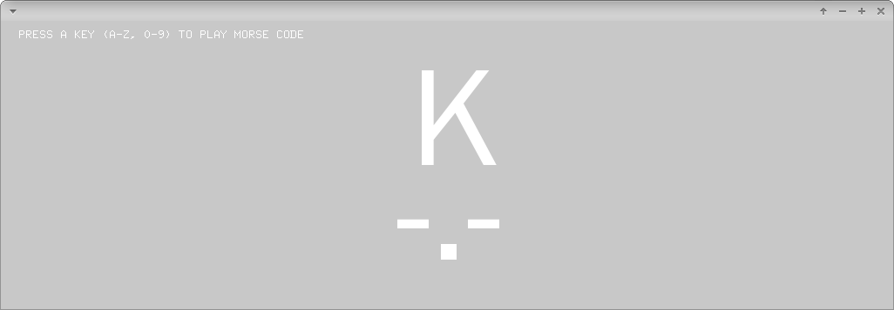

# fileBufferLoadingCSVExample



### Learning Objectives

This example demonstrates how to read a CSV file and process its content. It loads a list of morse codes and displays and plays the related code when you press a key. It shows you how to..
* load data from CSV to ```ofBuffer```
* split lines from CSV file into ```vector<std::string>```
* create debugging output via ```ofLogVerbose(..)```
* play morse code via speaker <3


### Expected Behavior

When launching this app, you should see a screen with instructions on the top.

Instructions for use:
* Press keys from ```0``` to ```9``` and from ```a``` to ```z```. It should show the related morse codes and play them via the speaker.

### Other classes used in this file

This Example uses the following classes:

* http://openframeworks.cc/documentation/graphics/ofTrueTypeFont/
* http://openframeworks.cc/documentation/sound/ofSoundPlayer/
