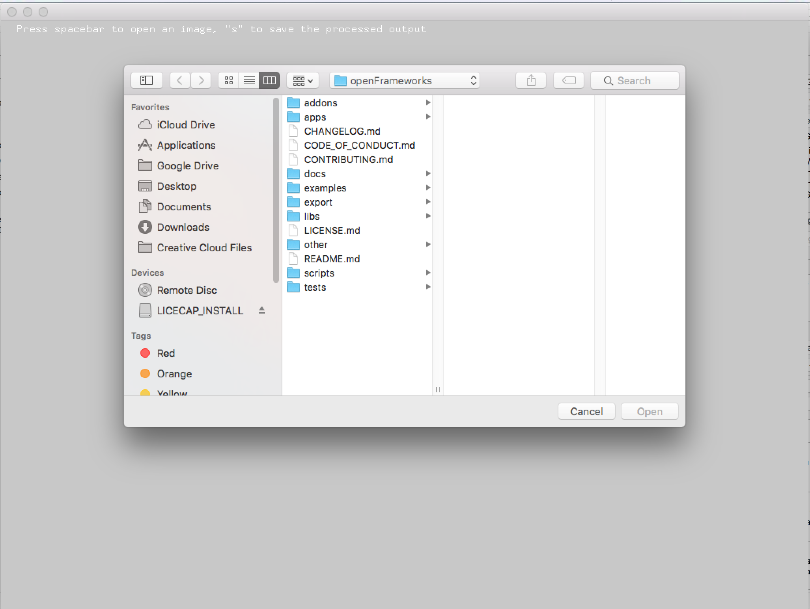

#About fileOpenSaveDialogExample




###Learning Objectives

This example demonstrates how to use the file dialog to select and save files from and to directories of your choosing.  

In the code, pay attention to: 

* Use of ```ofSystemLoadDialog``` to invoke the system level file dialog
* Use of ```ofFileDialogResult``` to store the result of the invokation
* Use of ```ofFileDialogResult.getPath()``` to retrieve the path to the file selected
* Determing the file extension using ```file.getExtension()```
* Saving the file using ```ofSystemSaveDialog()```


### Expected Behavior

When launching this application you will be able to select an image to load by pressing the ```spacebar``` key which will bring up the system level file selection dialog.  That image can then be saved to another location using the ```s``` key, which will invoke the system level file save dialog. 

When the key ```spacebar``` is pressed:

* The application will invoke the system level file selection dialog from which you can select what image you want to load into the application. Once selected, the application will load it and it will be shown in the application.  

When the key ```s``` is pressed:

* The application will invoke a system level file save dialog, where you can select where to save the currently loaded image in the application. Once a destination has been selected, it will write the file to that location. 

Instructions for use:

* Load an image file ( png or jpg )  by pressing ```spacebar``` and selecting an image to load
* Save the loaded image by pressing ```s``` and selecting the destination to write that file. 


###Other classes used in this file

This Example uses no other classes.