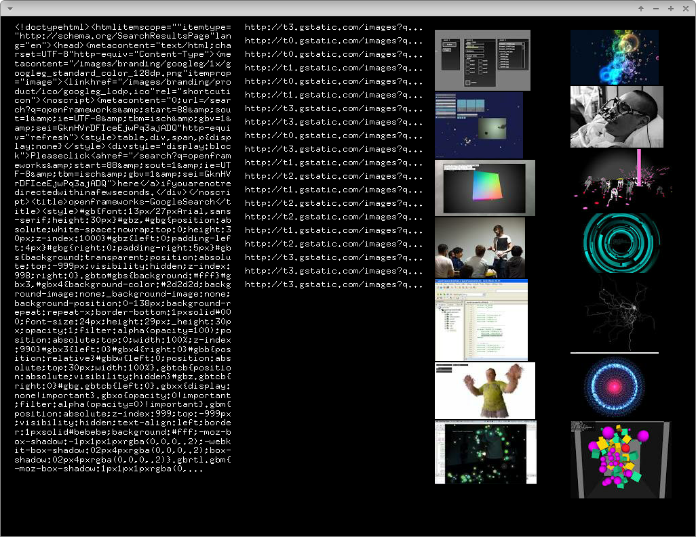

# regularExpressionExample



### Learning Objectives

This example demonstrates how to parse a string using regluar expressions. It will also cover basic HTTP requests. You will learn how to ...
* perform an HTTP request using ```ofLoadURL()```
* handle HTTP responses with ```ofHTTPResponse```
* use ```Poco::RegularExpression``` to retrieve relevant information from a string
* load images based on the parsed data


### Expected Behavior

When launching this app, you should see a screen divided into three columns. In the background the app performs a search for ```openframeworks``` images on Google. Using regular expressions the table containing the images is extracted from the HTTP response. It is displayed in the left column. The URLs of the images are being retrieved by regular expressions as well and displayed in the middle. The right column shows the images itself.

Instructions for use:

* Press any key to search for the next 22 images on Google using the term ```openframeworks```

### Other classes used in this file

This Example uses the following classes:

* http://openframeworks.cc/documentation/utils/ofURLFileLoader/
* http://openframeworks.cc/documentation/utils/ofHttpResponse/
* http://openframeworks.cc/documentation/graphics/ofImage/
