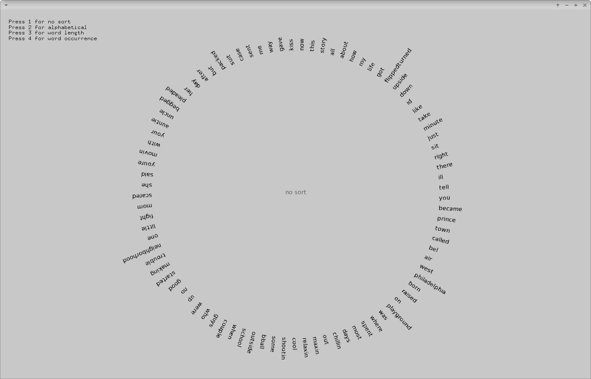

# sortingExample



### Learning Objectives

This example demonstrates how to sort a vector alphabetically, by word length or by word occurence. It shows you how to..
* load words from a file into a vector
* create custom sorting functions
* sort the vector using the function ```ofSort()```


### Expected Behavior

When launching this app, you should see a screen with words circularly arranged on the right side.

Instructions for use:

* Press keys from ```1``` to ```4``` to switch sorting algorithms

### Other classes used in this file

This Example uses the following classes:

* http://openframeworks.cc/documentation/graphics/ofTrueTypeFont/
* http://openframeworks.cc/documentation/utils/ofUtils/
