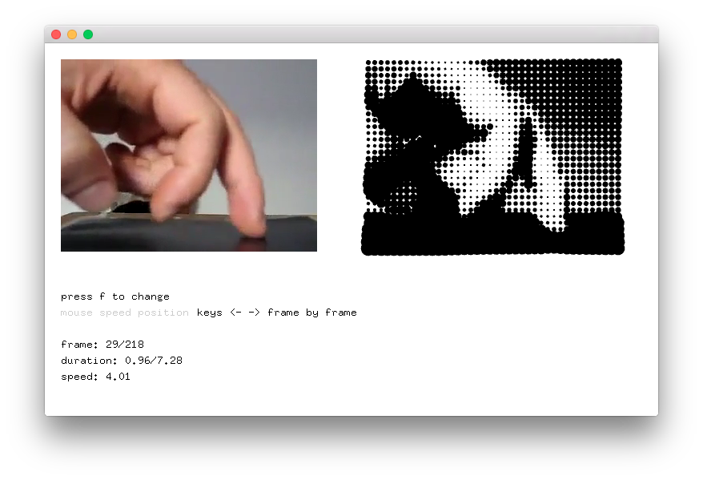
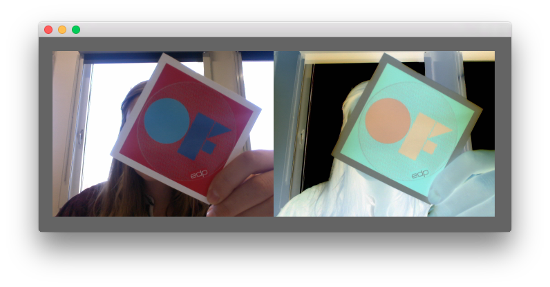
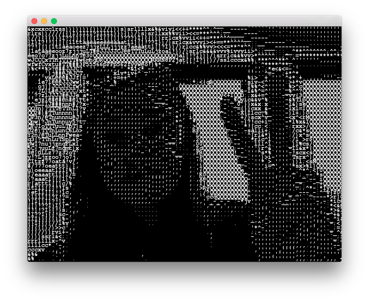

# About video

### Learning Objectives

In this section of examples, you will find examples of different ways to work with video in openFrameworks (loading a file, using the webcam, basic video manipulation).

### Table of Contents

* [videoPlayerExample](videoPlayerExample/) - Loading a video from your disk
* [videoGrabberExample](videoGrabberExample/) - Grabbing and displaying the webcam image
* [asciiVideoExample](asciiVideoExample/) - Displaying the webcam image as ASCII art

### At a Glance

[videoPlayerExample](videoPlayerExample/)

--

[videoGrabberExample](videoGrabberExample/)

--

[asciiVideoExample](asciiVideoExample/)

