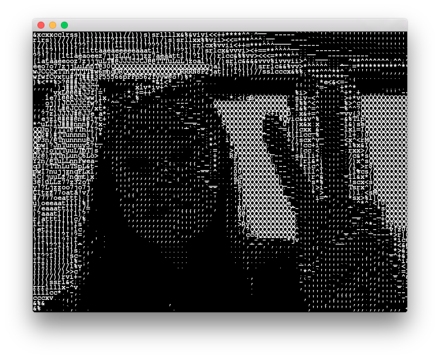

# asciiVideoExample

### Learning Objectives

This example is  based on the Processing "ASCII Video" example by Ben Fry and it is designed to demonstrate how to re-interpret live video as text to make it look like some good old ASCII art!

Studying the code behind this example will help you understand:

* How to access the webcam image using ``ofVideoGrabber``
* How to change background video alpha value based on the cursor's x-position
* How to access a ``string`` (ours is called ``asciiCharacters``) as a ``char`` array
* How to iterate through a movie frame's pixels
* How to use ``getLightness()`` (returns the average of its RGB values) to display a different ASCII character

### Expected Behavior

When launching this app (if your computer has a webcam), you should see an ASCII art image of the webcam stream.

Instructions for use:

* Try moving your cursor left and right in order to change the video transparency.

### Classes used in this example

This example uses the following classes: 

* ``ofVideoGrabber``
* ``ofPixels``
* ``ofTrueTypeFont`` 