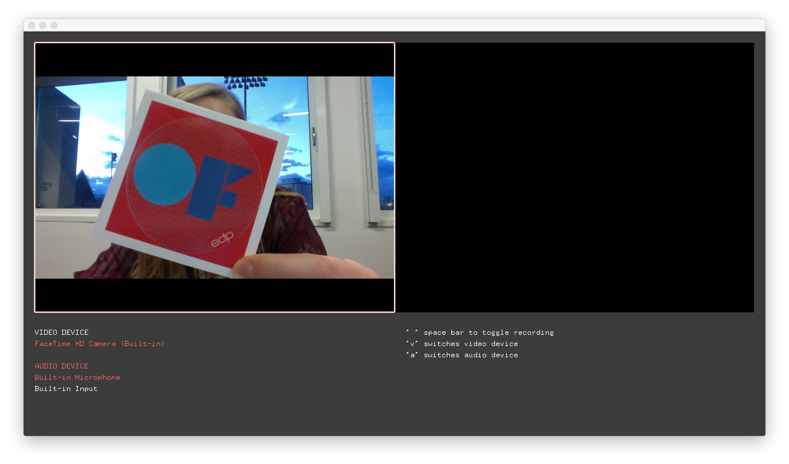

# osxVideoRecorderExample

### Learning Objectives

This openFrameworks example demonstrates how to use the OS X specific video grabber to record synced video and audio to disk.

Studying this example will help you understand:

* how ``ofVideoGrabber`` can be used to grab the webcam image (see also ``videoGrabberExample`` for a simpler example)
* how to use ``ofVideoPlayer`` to play a video (see also ``videoPlayerExample``)
* how ``ofQTKitGrabber`` can be used to record video using the functions ``initRecording()``, ``startRecording()``, ``stopRecording()``
* how to list available devices using ``listVideoDevices()`` and ``listAudioDevices()``
* how ``ofPtr`` can help us manage a pointer for us so we don't need to delete it later
* how to use ``ofAddListener`` to listen to the ``videoSavedEvent`` with a callback function, (see examples in the "events" section to learn more about event handling in OF).
* how to list available video codecs on your system (``4a`` in the comment section), and how to set a custom codec (``4b``)
* how to handle keyboard ``events`` in ``keyPressed()`` and ``keyReleased()``
* how to use ``ofPushStyle()`` and ``ofPopStyle()`` in the ``draw()`` function to change the color, fill, and line width temporarily

### Expected Behavior

When launching this app (if your computer has a webcam), you should see what your webcam sees in the top left corner. When you press ``space``, the border of the webcam image should blink red while you are recording. Press ``space`` again to stop recording. The finished video should appear on the right (next to the webcam image).

Instructions for use:

* Press ``space`` to toggle recording
* Press ``v`` to switch video device
* Press ``a`` to switch audio device

### Classes used in this example

This example uses the following classes: 

* ``ofPtr`` 
* ``ofQTKitGrabber``
* ``ofVideoGrabber``
* ``ofVideoPlayer``
