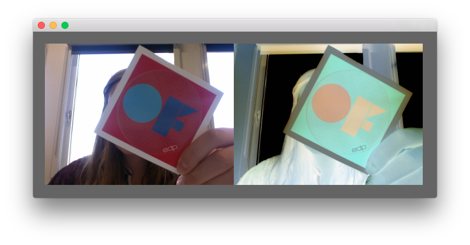

# videoGrabberExample

### Learning Objectives

This openFrameworks example is designed to demonstrate how to access the webcam.

Studying this example will help you understand:

* how to print a list of available webcam devices (``ofVideoDevice``)
* how to initiate ``ofVideoGrabber``
* how to allocate memory on your graphics card for an ``ofTexture`` or for ``ofPixels``
* how to iterate through a webcam frame's pixels (by accessing its ``ofPixels``)
* how to manipulate the webcam image / how to invert an image

### Expected Behavior

If your computer has a webcam, you should be able to see the webcam image when launching this app on the left and an inverted version of the webcam stream on the right.

### Classes used in this example

This example uses the following classes: 

* ``ofVideoGrabber``
* ``ofPixels``
* ``ofTexture``