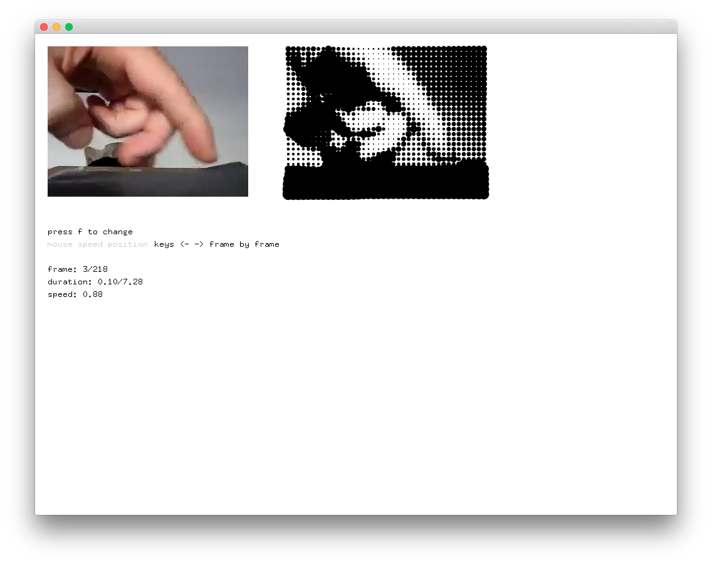

# videoPlayerExample

### Learning Objectives

This example is designed to demonstrate how to play video in openFrameworks.

* How to load a video from the ``   data/`` folder
* How to play a video
* How to change the video playback speed
* How to use the mouse speed to control the video playback speed
* How to go to the previous/next frames using arrow keys
* How to iterate through a movie frame's pixels and use the pixel values to control the sizes of circles

Notice how ``movie.setSpeed()``, ``movie.setPaused()``, ``movie.setPosition()``, ``movie.nextFrame()``, ``movie.prevFrame()`` can be used to control the movie.

### Expected Behavior

When launching this app, you should see a screen with the video we loaded on the left, and a stylized video (black circles with different sizes depending on pixel brightness) on the right.

Instructions for use:

* Try moving your cursor in order to change the video playback speed
* Try pressing the left and right arrow keys to go to the next/previous frame.

### Classes used in this example

This example uses the following class: 

* ofVideoPlayer