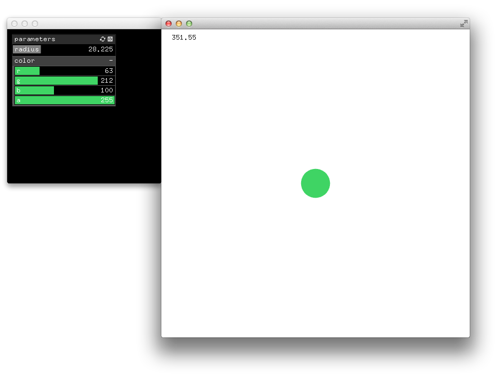

# About multiWindowExample




### Learning Objectives

This example demonstrates how to create an additional app in a separate window to hold a GUI with parameters. Changing the GUI's parameters's values update the appearance of a circle in the main window.

In the code, pay attention to: 

* ```ofCreateWindow``` to create additional windows


### Expected Behavior

* A circle displayed at the center of the main window changes in color, opacity and scale based on the parameters values of a GUI displayed in a separate window.


Instructions for use:

* drag the sliders of the parameters radius, r, g, b, a, to modify the appearance of the circle.

 

### Other classes used in this file

* ```GuiApp```


