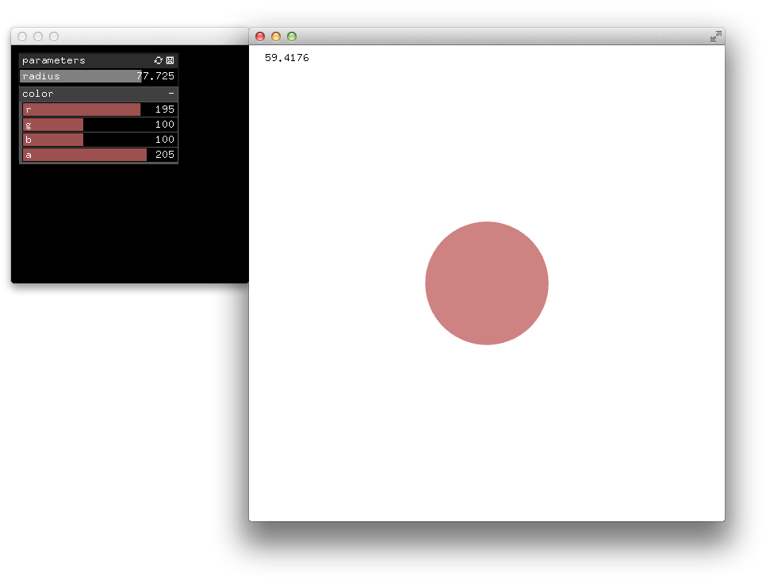

# About multiWindowOneAppExample




### Learning Objectives

This example demonstrates how an eventListener added to a GUI window uses the values of the parameters displayed to update the appearance of a circle in the main window.


In the code, pay attention to: 

* ```ofAddListener``` to add a listener method to the GUI window using ```events().draw```
* ```ofParameterGroup``` A collection of parameters with events to notify if a parameter changed
* ```ofParameter``` holds a value and notifies its listeners when it changes


### Expected Behavior

* A circle displayed at the center of the main window changes in color, opacity and scale based on the parameters values of a GUI displayed in a separate window.


Instructions for use:

* drag the sliders of the parameters radius, r, g, b, a, to modify the appearance of the circle.
 

### Other classes used in this file

This Example uses no other classes.
