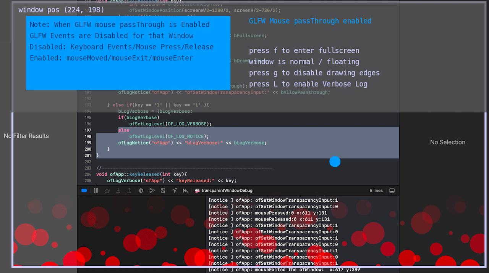

# About transparentWindow




### Learning Objectives

This example demonstrates how to set and get window properties for GLFW Transparency setup and GLFW attribute for mouse passThrough this transparency to context behind the window 

In the code, pay attention to: 

* Use of ````ofSetWindowTransparencyInput()```` to set if mouse input passThrough is enabled or disabled for the window
* Use of ````mouseMoved()```` used to check if within bounds to disable passThrough to region developer elected
* The GLFW events that are disabled (keyboard press/release, mouse press/release) when passThrough is enabled, and the events that work like mouseMove, mouseExit, mouseEnter for the Window
* Use of ````ofSetFullscreen()```` to toggle between fullscreen and windowed modes

main.cpp setup 
```
ofGLFWWindowSettings settings;
	settings.transparent = true;
	settings.transparentInput = true;
	settings.floating = true;
	settings.decorated = false;
```

### Expected Behavior

When launching this application you will see the following:

* A Transparent window with guides drawn for the edges 1280x720
* The top quandrant has an area that when you mouseMove to passThrough will be disabled
* The transparent quadrant below that when mouseMove to - passThrough is enabled
* A GLFW ```floating window``` with no titlebar shown even when set
* A ball that is constantly boucing off the interior of the window, affecting the position of the window
* Text at the top that reports the mode of the window, and some commands for toggling logs, ( fullscreen or normal ) etc

When the key ````g```` is pressed:

* The Guide Rectangles will not be drawn and you will see the full transparency of the Window. Toggle on or off

When the key ````h```` is pressed:

* passThrough will be enabled if in state of disabled. toggling it to disable will not work due to the GLFW events. See note

When the key ````f```` is pressed:

* If the window is in normal mode, the window will go in fullscreen mode, hiding the cursor 
* If the window is in fullscreen mode, the window will return to the normal mode and show the cursor

When the key ````l```` is pressed:

* Verbose Logs / Notice Logs - Toggle

Instructions for use:

* Running the application will result in the transparent window slightly moving position as the ball hits an interior wall


### Other classes used in this file

This Example uses no other classes.