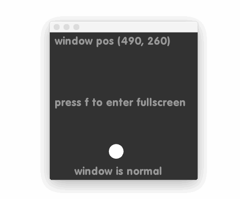

# About windowExample




### Learning Objectives

This example demonstrates how to set and get window properties such as the position, and toggle between playback modes of fullscreen and windowed. 

In the code, pay attention to: 

* Use of ````ofGetScreenWidth()```` and ````ofGetScreenHeight()```` to get the height and width of the screen
* Use of ````ofSetWindowPosition()```` to set the position of the window
* Use of ````ofSetWindowShape()```` to set the window size
* Use of ````ofSetFullscreen()```` to toggle between fullscreen and windowed modes  


### Expected Behavior

When launching this application you will see the following:

* A window with a gray background that is 300x300
* Text at the top that reports the position of the window
* A ball that is constantly boucing off the interior of the window, affecting the position of the window
* Text at the bottom that reports the mode of the window ( fullscreen or normal ) 

When the key ````f```` is pressed:

* If the window is in normal mode, the window will go in fullscreen mode, hiding the cursor 
* If the window is in fullscreen mode, the window will return to the normal mode and show the cursor

Instructions for use:

* Running the application will result in the window slightly moving position as the ball hits an interior wall.


### Other classes used in this file

This Example uses no other classes.